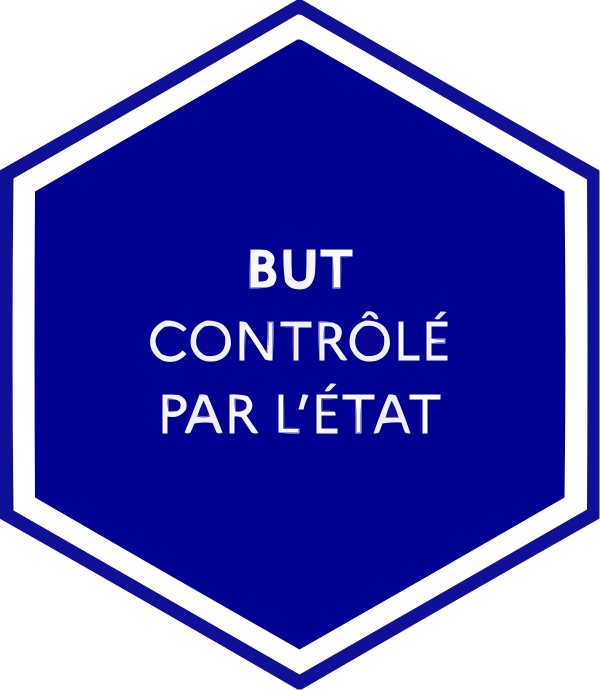

<h1 align="center">Bachelor Universitaire de Technologie</h1>

    

    
    
    
    
    

## Support

- [BUT Informatique - Programme national](docs/PN-LP-BUT-INFO-2022.pdf)
- [CS50x 2025 - Harvard University](https://cs50.harvard.edu/x/2025/)
- [Algorithms, 4th Edition - Princeton University](https://algs4.cs.princeton.edu/home/)
- [IBM Topics](https://www.ibm.com/topics)
- [Microsoft Learn](https://learn.microsoft.com/en-us/)
- [Oracle Healthcare Applications](https://docs.oracle.com/en/industries/health/index.html)

## Projets - Situations d'Apprentissage et d'Évaluation (SAÉ)

### [Semestre 1](docs/sae/SAE-1.md)

- [ ] SAÉ 1.01 : Implémentation d’un besoin client.
- [ ] SAÉ 1.02 : Comparaison d’approches algorithmiques.
- [ ] SAÉ 1.03 : Installation d’un poste pour le développement.
- [ ] SAÉ 1.04 : Création d’une base de données.
- [ ] SAÉ 1.05 : Recueil de besoins.
- [ ] SAÉ 1.06 : Découverte de l’environnement économique et écologique.

### [Semestre 2](docs/sae/SAE-2.md)

- [ ] SAÉ 2.01 : Développement d’une application.
- [ ] SAÉ 2.02 : Exploration algorithmique d’un problème.
- [ ] SAÉ 2.03 : Installation de services réseau.
- [ ] SAÉ 2.04 : Exploitation d’une base de données.
- [ ] SAÉ 2.05 : Gestion d’un projet.
- [ ] SAÉ 2.06 : Organisation d’un travail d’équipe.

### [Semestre 3](docs/sae/SAE-3.md)

- [ ] SAÉ 3.Real.01 : Développement d’une application.

### [Semestre 4](docs/sae/SAE-4.md)

- [ ] SAÉ 4.Real.01 : Développement d’une application complexe.

### [Semestre 5](docs/sae/SAE-5.md)

- [ ] SAÉ 5.Real.01 : Développement avancé.

### [Semestre 6](docs/sae/SAE-6.md)

- [ ] SAÉ 6.Real.01 : Évolution d’une application existante.

## Compétences - Composantes Essentielles (CE)

- [ ] [CE1 - Réaliser](docs/rdc/RDC-1.md)
- [ ] [CE2 - Optimiser](docs/rdc/RDC-2.md)
- [ ] [CE3 - Administrer](docs/rdc/RDC-3.md)
- [ ] [CE4 - Gérer](docs/rdc/RDC-4.md)
- [ ] [CE5 - Conduire](docs/rdc/RDC-5.md)
- [ ] [CE6 - Collaborer](docs/rdc/RDC-6.md)

## Licence

[MIT](LICENSE.md)
